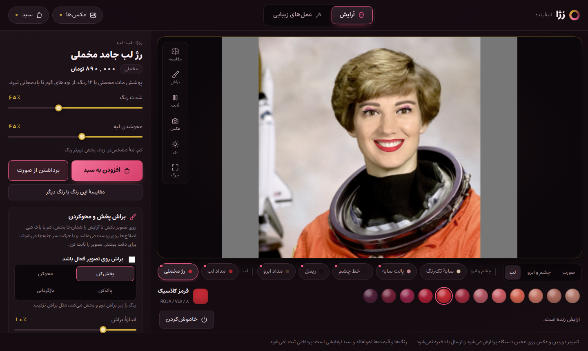
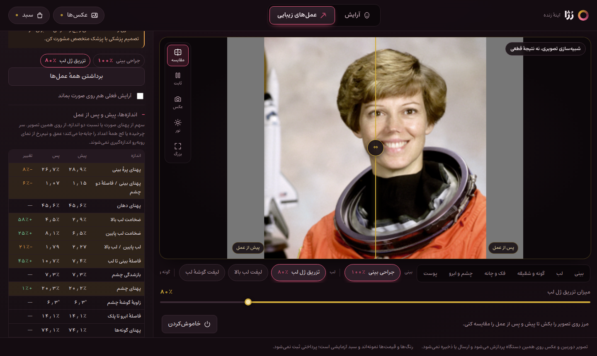
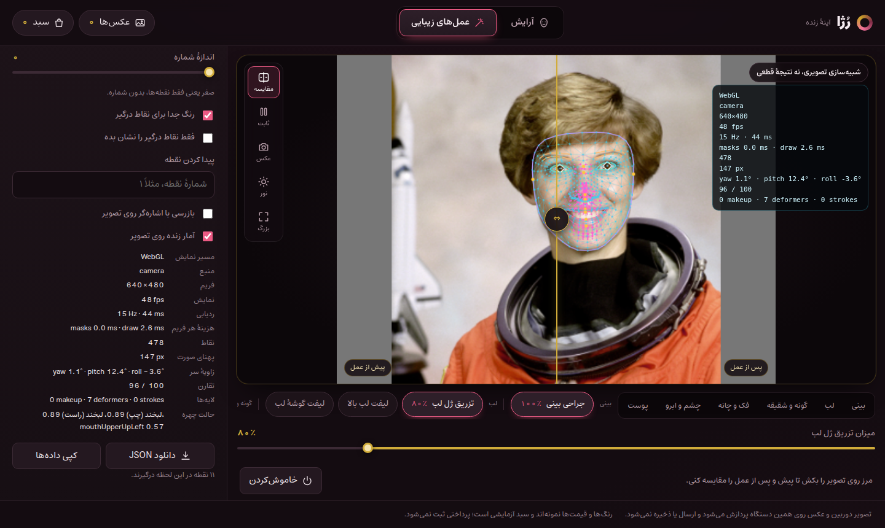

# رُژا · Roja

A live mirror that runs entirely in the browser. Try makeup on your own face before you
buy it — foundation matched to your skin, blush, contour, eyeshadow, liner, mascara,
brows and lips — then blend, fade or erase it by hand with a brush, compare two shades
side by side, or pick a cosmetic procedure and see an approximation of the shape change.
Everything happens on the device: the camera frame becomes a GPU texture and is never
uploaded or stored, and no asset is fetched from anywhere but this repository.

**[Open the mirror →](https://YOUR-USERNAME.github.io/roja/)**

> آینه‌ای زنده که کاملاً داخل مرورگر اجرا می‌شود. آرایش را پیش از خرید روی صورت خودت
> امتحان کن، با براش پخش یا محوش کن، دو رنگ را کنار هم ببین، یا نتیجهٔ تقریبی یک عمل
> زیبایی را ببین. تصویر دوربین روی همان دستگاه پردازش می‌شود و هیچ‌جا فرستاده یا ذخیره نمی‌شود.

The interface is in Persian and laid out right-to-left.

| makeup | procedures | debug |
|---|---|---|
|  |  |  |

---

## This is not a medical tool

The procedure view is a **visual simulation of a shape change, nothing more**. It does not
model swelling, bruising, healing, scarring, skin thickness, or what any particular surgeon
would actually achieve, and it is not a prediction of a result. The "lasts" and "recovery"
notes are general, commonly quoted ranges, not advice. Colours are samples on a screen, not
measured product matches — ambient light, the camera and natural skin tone all move what
you see. For any medical decision, talk to a qualified doctor.

## What is in it

**آرایش — makeup.** Sixteen products in Roja's own range (121 shades), grouped as face,
eyes and lips: matte foundation and a light skin tint, concealer, contour, powder and cream
blush, highlighter, single eyeshadows and four-pan palettes, liquid liner in four shapes
(thin, classic, winged, smudged), mascara (lengthening or volumising), brow pencil, lip
liner, velvet and liquid-matte lipsticks, and gloss that layers over a lipstick. Every
product has intensity (or coverage) and edge-feather controls, a finish (matte, velvet,
satin, cream, gloss, shimmer, metallic, dewy) and a sample price.

- **Brush — پخش‌کن، محوکن، پاک‌کن، بازگردانی.** Paint on the mirror to *blend* colour out
  softly, *fade* it a little at a time, *erase* it, or *restore* whatever you changed. Each
  stroke works on all makeup or on the current product only, can be undone, and is pinned
  to the face rather than the screen, so it stays put when you move. Freeze the camera
  frame for precise work.
- **Shade finder.** Reads the colour of your cheeks, forehead and chin for a moment and
  suggests the nearest foundation, skin tint and concealer shades, with an undertone
  estimate. Looks that include a skin product use it automatically.
- **Looks.** Six ready-made combinations (natural, office, evening, smoky, bridal, bold lip)
  in one tap; each product can then be changed on its own.
- **Compare.** A seam across the face: with and without makeup, or — after pinning a
  shade — two shades of the same product side by side.
- **Lighting preview.** See the look under window daylight, golden-hour sun, office
  fluorescent light, a warm evening room or a camera flash.
- **Photos.** Use a photo instead of the camera (pick a file or drop it on the mirror), and
  take snapshots of the mirror to compare two of them later or save them. Snapshots stay
  in the page's memory until you save them.
- **Sample cart** with quantities, prices and a total; "add the whole look" puts every
  product on the face in the cart. No order is ever placed.

**عمل‌های زیبایی — procedures.** Seventeen procedures in six regions, each a set of weights
over a shared field of localised deformers: rhinoplasty (natural, semi-fantasy or fantasy),
lip filler (balanced, upper-lip or full), lip lift, lip-corner lift, cheek filler, buccal fat
removal, temple filler, jaw contouring (masseter Botox or surgery), chin implant or filler,
V-line, face lift, eyelid surgery, fox-eye thread or canthoplasty, brow lift, Botox for the
forehead and crow's feet, under-eye filler and skin resurfacing — the last three change skin
texture rather than shape. Each shows its kind, how long it typically lasts and its usual
recovery. Several can be combined, the current makeup can stay on during the preview, and a
measurements table shows what the preview changed — nose width, lip thickness and ratio,
eye opening and canthal tilt, jaw and chin width, facial thirds — before and after. Drag the
brass seam across your face to compare. Twenty-six region controls are available for fine
tuning.

**حالت دیباگ — debug overlay.** Every landmark the model returns, numbered, with the ones
driving the current selection picked out in a second colour. Optional layers: the tracking
mesh, the named contours, the face-local axes every size is measured in, the makeup masks,
the displacement field of the procedures and the brush strokes. Find a landmark by number,
or point at the mirror to inspect the nearest one. Live stats (renderer, frame size, frame
rate, tracking rate and latency, mask and draw cost, head pose, symmetry, expression
scores) in the panel or on the mirror, and an export of all of it as JSON.

## How it works

- **Face tracking** — MediaPipe Face Landmarker, 478 points with head pose and expression
  scores, running in a Web Worker so the interface never blocks. The model runs on the GPU
  wherever the browser has a real one (not on iPhones, and not where WebGL is only emulated
  in software); otherwise, or if the GPU fails, on the CPU. Each camera frame is measured
  once, as soon as the last result is back, and on the fast path it reaches the worker as a
  `VideoFrame`, with no copy. Where a worker cannot run the model at all (iPhones before
  iOS 17 have no WebGL in workers) the same code, `face-core.js`, runs on the page instead.
  The model and its WebAssembly runtime are served from this repo.
- **In step** — a copy of each frame sent to the tracker is kept, and when its landmarks
  come back that very frame is shown with them, so the makeup sits on the face in the
  picture instead of trailing the live video by a tracking round-trip. The picture then
  moves at the tracker's pace, so this is done only while it keeps up (16 frames a second
  or more); below that the live video is shown with the latest landmarks. Landmarks are
  steadied by a One Euro filter: jitter is smoothed away while the face is still, and the
  smoothing fades out as it moves, so it adds no lag to a turn of the head.
- **Makeup** — each product is a soft mask, painted once in a front-on view of MediaPipe's
  canonical face (`facemesh.js`, read out of the face model by `tools/facemesh.cjs`)
  whenever a product or setting changes. Every frame the face mesh, placed on the live
  landmarks, carries it onto the face: a few hundred triangles on the GPU instead of
  repainting on the CPU each time the face moves, and a mask that bends with a smile or a
  blink. The mesh's triangles across the eye and mouth openings are left out, so colour is
  never stretched over open lips or an open eye. A WebGL pass then recolours the camera
  texture under the mask. The colour is scaled to the light
  on the face and modulated by each pixel's brightness relative to the region's mean, so
  lip creases, shading and skin texture show through it as they do with real product.
  Finish decides how glints behave: matte flattens them, gloss sharpens them, shimmer
  scatters specks. Foundation adds edge-preserving smoothing that stays on skin. Soft edges
  come from a blur built only from `drawImage` scaling (`blur.js`), which every browser
  draws the same way; canvas shadows and filters do not, on iPhones above all. Broad
  masks are painted at half resolution, only the painted part of each is uploaded, and
  every pass is scissored to its layer, so a full look stays cheap. Without WebGL, the same
  masks are painted from the live landmarks in flat colour on a 2D overlay.
- **Brush** — every stroke point is stored as barycentric weights over the three landmarks
  around it, and the strokes are replayed into coverage maps in the face's own space, so a
  stroke stays on the skin where it was drawn however the face moves. A
  stroke is one path, so going over the same spot twice in one stroke does not double it.
- **Procedures** — the frame is carried through a 64×48 grid mesh displaced by a sum of
  smoothstep-falloff deformers anchored on landmarks. Every radius and axis is expressed in
  a face-local frame, so edits track head tilt, distance and rotation. Displacement decays
  to zero away from each anchor, so the background is never touched and an all-zero
  setting is a pixel-exact copy of the camera frame. The measurements move the landmarks
  through the same field.
- **Before/after** — a second composite drawn through a `gl.scissor` on one side of the
  seam.

No build step, no framework, no bundler. Plain ES modules served as files.

## Privacy

The camera frame, or the photo you pick, is processed on the device and never sent or
stored. The only pixels read back are the ones you ask for: a snapshot you take (kept in the
page until you save it or close the page) and, while the shade finder runs, a few small skin
patches that the face worker averages into one colour.

## Browsers

Chrome, Edge, Firefox and Samsung Internet on Android and desktop; Safari, and Chrome or
Firefox on iPhone and iPad (all WebKit there); Safari on the Mac. The camera needs HTTPS.
Browsers built into other apps (Instagram, Telegram…) often have no camera: the page says
so and suggests opening it in Safari or Chrome, and a photo still works there. When the
camera cannot start, the message names the reason and where to allow it, with an error
code; the debug panel shows the browser, whether tracking runs in a worker or on the page,
and the last error.

## Running it locally

Needs [Node](https://nodejs.org) (only to serve the files — nothing is compiled).

```bash
node tools/preview.cjs      # serves this folder at http://127.0.0.1:4173
```

On Windows you can double-click `run-local.cmd` instead, which starts the server and opens
the browser.

The camera works on `127.0.0.1` and `localhost` because browsers treat them as secure
contexts. It will **not** work over a plain-HTTP LAN address such as `192.168.x.x` — that
needs HTTPS. A photo works anywhere.

Keyboard: **B** brush, **[ ]** brush size, **Ctrl+Z** undo a stroke, **C** compare,
**F** freeze the frame, **S** snapshot.

## Android and installing

- **Android app** — [`android/`](android/README.md) wraps this site in a native app with
  every file inside the APK and no network permission. The *Android app* workflow builds the
  APK and runs it on an emulator; each tested build of `main` is published as a release, so
  [`releases/latest/download/roja.apk`](https://github.com/soroushaz1/roja/releases/latest/download/roja.apk)
  always downloads the newest one.
- **Install from the browser** — the site is also an installable web app
  (`manifest.webmanifest`). Once installed, `sw.js` keeps its files, including the face
  model after the first camera use, so it opens offline. The service worker is not
  registered on `localhost`, so development always serves fresh files.

## Tests

```bash
node tools/preview.cjs       # in one terminal
node tools/roja-check.cjs    # in another
```

A Playwright run against a simulated camera. It checks that a bare face and a zero-strength
procedure both reproduce the camera frame pixel-exactly; that every product colours the
face without touching the eye openings or anything off the face; that a red reads as red and
the finish and texture controls change the result; that the brush erases, fades, restores
and blends — and that an erased area follows the face when it moves; both compare modes;
every look, the shade finder, the lighting preview and snapshots; that every procedure moves
pixels in its own region and resets cleanly, variants differ and the measurements register
the change; that the before/after seam sits on the cut it draws; that losing the face leaves
nothing stale on screen; every debug layer, the landmark search, the stats and the export;
that the mirror never resizes when the panel's content changes; that the phone layout keeps
the mirror and its controls on one screen; that a photo opens the right way round after a
camera session; that a device without WebGL still gets working makeup; and that an
iPhone-like browser — a worker that cannot run the tracker, a `video.play()` refused until
a tap — still tracks the face on the page, offers a tap to start the picture, never hides the
camera video, and shows makeup. Last, it runs the model on the GPU with frames handed over
as `VideoFrame`s, and on the CPU route iPhones take, each with frames shown in step with
their landmarks: the picture must equal the camera's and makeup must appear. Point it at a
deployed copy with `ROJA_URL`. Playwright is found through `PLAYWRIGHT_MODULE`, a normal
`require` or the global npm folder, and the browser through `ROJA_CHROMIUM`, an installed
Chrome or Playwright's own Chromium.

`node tools/roja-perf.cjs` prints the app's own numbers (pictures and tracked frames a
second, tracking latency, the model's time per frame, mask and draw cost) for a few looks.
Headless Chromium only emulates a GPU, so compare runs with each other; on a phone, open the
debug panel for the same numbers. `?gpu=0` keeps the model on the CPU and `?gpu=force` puts
it on the GPU regardless, for comparing the two.

## First load

About 15 MB, mostly the face model and its WebAssembly runtime, then cached. That is the
cost of doing the tracking on the device instead of sending the camera somewhere.

## Licence

The code here is MIT — see [LICENSE](LICENSE). Bundled third-party assets keep their own
licences; see [THIRD-PARTY.md](THIRD-PARTY.md).
